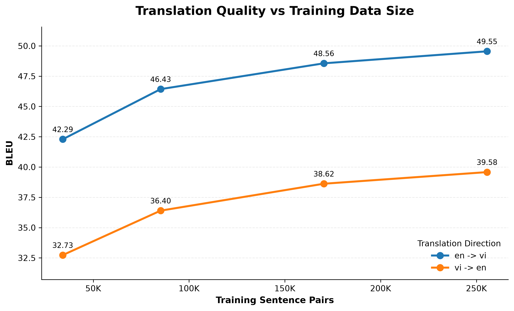
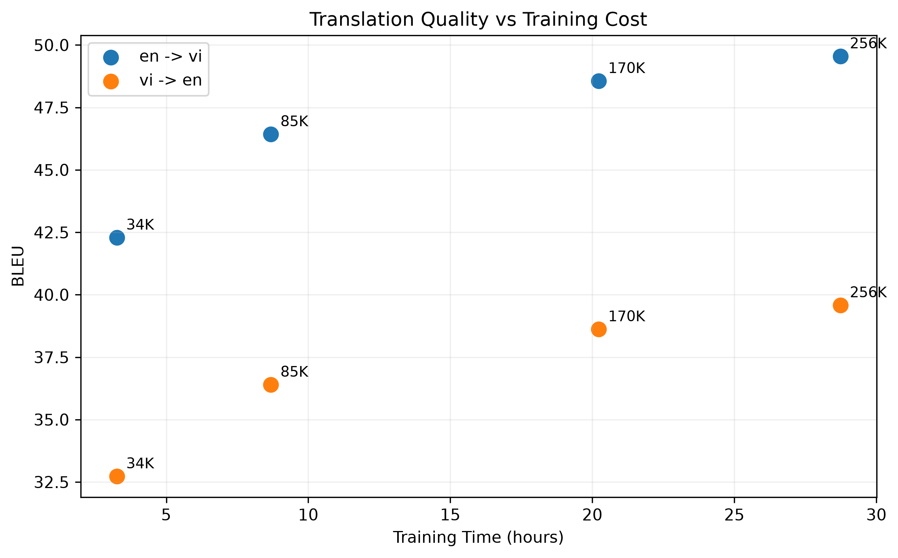

# Medical Bidirectional Machine Translation (EN ↔ VI)

Fine-tune mô hình `envit5-base` để dịch máy hai chiều **Anh ↔ Việt trong lĩnh vực y khoa**, sử dụng bộ dữ liệu song ngữ chuyên ngành **MedEV**. Kèm theo thực nghiệm data-efficiency (BLEU/METEOR/TER theo % lượng dữ liệu train) và demo trực tuyến.

🔗 **[Xem demo trực tiếp tại đây](https://huggingface.co/spaces/ndhieu1101/medical-en-vi-translator)**

## Dataset

Dự án dùng [**MedEV**](https://huggingface.co/datasets/nhuvo/MedEV) — bộ dữ liệu song ngữ Anh-Việt chuyên ngành y khoa, gồm 358.885 cặp câu được thu thập từ tóm tắt bài báo khoa học, MSD Manuals, tóm tắt luận án y khoa và các bản dịch bài báo chuyên ngành.

| Split | Số cặp câu |
|---|---|
| Train | 340.897 |
| Validation | 8.939 |
| Test | 8.960 |

> Vo, N., Nguyen, D. Q., Le, D. D., Piccardi, M., & Buntine, W. (2024). *Improving Vietnamese-English Medical Machine Translation*. LREC-COLING 2024. [arXiv:2403.19161](https://arxiv.org/abs/2403.19161)

**Lưu ý bản quyền**: dữ liệu được thu thập từ các nguồn công khai (tạp chí khoa học, MSD Manuals...) nhưng **không được phép sử dụng cho mục đích thương mại** — chỉ dùng cho nghiên cứu/giáo dục, theo đúng cam kết của nhóm tác giả gốc.

## Model gốc

Fine-tune từ [`VietAI/envit5-base`](https://huggingface.co/VietAI/envit5-base) — biến thể song ngữ Anh-Việt của T5, pretrain trên 80GB text tiếng Anh + 80GB text tiếng Việt.

## Cấu trúc thư mục

```
medical-bidirectional-translator/
├── config/
│   └── config.yaml              
├── src/
│   ├── __init__.py
│   ├── data_utils.py         
│   ├── preprocessing.py        
│   ├── prepare_data.py        
│   ├── model_utils.py          
│   ├── metrics.py               
│   ├── evaluation.py            
│   └── train.py                 
├── demo/
│   ├── app.py                   # Gradio app cho HF Spaces
│   └── requirements.txt
├── notebooks/
│   ├── 01_eda.ipynb             
│   └── 02_visual_results.ipynb
├── figures/                      
│   ├── bleu_vs_data_size.png
│   ├── bleu_vs_training_time.png
│   ├── meteor_vs_data_size.png
│   └── ter_vs_data_size.png
├── results/
│   └── sweep_results.json      
├── data/
│   ├── test
│   ├── train
│   ├── validation
│   └── dataset_dict.json                        
├── .gitignore          
├── run_sweep.py                 
├── check_prepared_data.py       
├── requirements.txt
└── README.md
```

## Cài đặt

```bash
pip install -r requirements.txt
```

Sau khi cài xong, tải resource cho metric METEOR (chỉ cần chạy 1 lần):

```python
import nltk
nltk.download("wordnet")
nltk.download("omw-1.4")
```

> **Lưu ý version**: `transformers` phải ghim `<5.0` khi train/evaluate trên Kaggle (bản 5.x gây `KeyError: 0` khi load tokenizer của `envit5-base` — xem mục Ghi chú triển khai). Môi trường Hugging Face Spaces lại yêu cầu ngược lại (`transformers>=5.0`) do xung đột với `gradio` bản mới — dùng `requirements.txt` riêng trong `demo/`.

## Cách chạy

```bash
# 1. Chuẩn bị dữ liệu (chỉ cần chạy 1 lần)
python -m src.prepare_data

# 2. Kiểm tra dữ liệu trước khi train (khuyến nghị, bắt lỗi sớm)
python check_prepared_data.py

# 3. Fine-tune model (chạy lại vẫn tự resume nếu có checkpoint)
python -m src.train

# 4. Đánh giá trên test set
python -m src.evaluation --model checkpoints/final
```

## Chạy trên Kaggle

Bật **Internet** và **GPU** trong Settings. Vì Kaggle giới hạn thời gian mỗi session, nên bật `huggingface.push_to_hub: true` trong `config.yaml` — `train.py` tự đẩy checkpoint lên Hub và tự resume ở session sau (đọc đúng checkpoint mới nhất, không tải lại toàn bộ lịch sử checkpoint).

## Thực nghiệm Data-Efficiency

**Câu hỏi**: cần bao nhiêu % dữ liệu MedEV để đạt chất lượng dịch tốt, và lợi ích biên (marginal benefit) giảm dần ra sao khi thêm dữ liệu?

### Phương pháp

- Xáo trộn tập train 1 lần với `seed=42` **trước khi tokenize**, sau đó lấy các tập con **lồng nhau**: tập nhỏ luôn là tập con của tập lớn hơn — đảm bảo mỗi mức chỉ khác nhau ở *lượng* dữ liệu, không bị nhiễu bởi việc chọn mẫu khác nhau giữa các lần chạy.
- 4 mức: 10%, 25%, 50%, 75% dữ liệu train (tính trên 340.694 cặp câu gốc), mỗi mức train 3 epoch trên GPU T4 (Kaggle).
- Script: [`run_sweep.py`](run_sweep.py) — tự động train + evaluate + lưu kết quả cho từng mức, tự resume phần còn lại.

### Kết quả

| % dữ liệu | Số cặp câu | En→Vi BLEU | En→Vi METEOR | En→Vi TER | Vi→En BLEU | Vi→En METEOR | Vi→En TER | Thời gian train |
|---|---|---|---|---|---|---|---|---|
| 10% | 34.069 | 42.29 | 0.664 | 49.24 | 32.73 | 0.607 | 60.54 | ~3.3h |
| 25% | 85.174 | 46.43 | 0.698 | 45.26 | 36.40 | 0.639 | 56.29 | ~8.7h |
| 50% | 170.347 | 48.56 | 0.715 | 43.24 | 38.62 | 0.658 | 53.99 | ~20.2h |
| 75% | 255.521 | 49.55 | 0.723 | 42.39 | 39.58 | 0.666 | 53.14 | ~28.7h |

*(số liệu đầy đủ: [`results/sweep_results.json`](results/sweep_results.json))*




### Nhận xét

- **Lợi ích biên giảm dần rõ rệt**, đúng như kỳ vọng lý thuyết: mỗi lần tăng gấp đôi dữ liệu, mức tăng BLEU (En→Vi) giảm dần đều — **+4.14** (10%→25%) → **+2.13** (25%→50%) → **+0.99** (50%→75%).
- **25% dữ liệu (85K câu, ~8.7h train) đã đạt phần lớn lợi ích**: BLEU 46.43, so với 49.55 ở 75% dữ liệu (28.7h train) — dùng **1/3 thời gian train** để đạt **~94% chất lượng** so với mức cao nhất đã thử. Đây là điểm cân bằng chi phí/hiệu quả tốt nếu tài nguyên GPU hạn chế.
- **50% → 75% dữ liệu tốn thêm ~8.5 giờ train chỉ để đổi lấy +0.99 BLEU** — chi phí biên rất cao, không hiệu quả nếu ưu tiên tốc độ.
- Chiều **En→Vi luôn đạt điểm cao hơn Vi→En** ở mọi mức dữ liệu (vd 75%: 49.55 vs 39.58 BLEU) — hợp lý vì `envit5-base` pretrain cân bằng 2 ngôn ngữ, nhưng cấu trúc câu tiếng Việt sang tiếng Anh (đặc biệt câu y khoa nhiều thuật ngữ) khó hơn về mặt cú pháp.

### Nhận xét lỗi dịch thuật
Qua kiểm tra sample translations ở cả 4 mức dữ liệu, phát hiện lỗi **hallucination địa danh nước ngoài** (specifically "Vientiane" → "Lào Cai") xuất hiện nhất quán ở MỌI checkpoint, kể cả mức dữ liệu lớn nhất — cho thấy đây là hạn chế mang tính hệ thống của phân phối dữ liệu MedEV, không thể khắc phục chỉ bằng cách tăng lượng dữ liệu cùng nguồn. **Ngoài ra ghi nhận: dịch chiều Vi→En xử lý tên riêng ổn định hơn En→Vi, do bản chất "copy" tên riêng dễ hơn "sinh mới" cách phiên âm.**

### Lessons learned — quá trình debug thực nghiệm này

Lần chạy sweep **đầu tiên** cho ra đường cong BLEU **bất thường**: mức tăng lớn nhất lại rơi vào bước cuối (50% → 75%) thay vì bước đầu — ngược hẳn với lý thuyết diminishing returns. Điều tra phát hiện nguyên nhân: `train.py` chọn subset bằng `.select(range(n))` trên dữ liệu **chưa được xáo trộn**, khiến các mức `train_size` là phần cắt tuần tự theo đúng thứ tự trong file gốc, không phải mẫu đại diện ngẫu nhiên cho toàn bộ phân phối dữ liệu — phần dữ liệu thêm vào ở mức lớn nhất vô tình rơi vào 1 cụm nguồn tương đồng cao (nhiều câu gần trùng lặp/paraphrase từ cùng nhóm luận văn), gây kết quả sai lệch không phản ánh đúng bản chất "thêm dữ liệu giúp ích thế nào". Đã sửa bằng cách thêm `dataset.shuffle(seed=42)` **trước** bước tokenize trong `prepare_data.py` — sau khi sửa, đường cong trở lại đúng hình dạng lý thuyết như bảng kết quả ở trên.

## Demo

Deploy dưới dạng Gradio app trên Hugging Face Spaces — xem code tại [`demo/app.py`](demo/app.py).

**Giới hạn quan trọng**: model được fine-tune trên MedEV — tập trung vào văn phong **tóm tắt nghiên cứu khoa học y khoa** ("Mô tả thực trạng...", "Đánh giá đặc điểm..."). Model dịch rất tốt với câu cùng văn phong này, nhưng chất lượng giảm rõ với câu hội thoại lâm sàng đời thường — do domain hẹp của dataset, không phải lỗi model.

So sánh sample translations ở cả 4 mức dữ liệu (10%, 25%, 50%, 75%) trên cùng 1 bộ câu test, phát hiện model liên tục dịch nhầm **"Vientiane" (thủ đô Lào) thành "Lào Cai"** (1 tỉnh của Việt Nam) — và lỗi này lặp lại y hệt ở **cả 4 checkpoint**, kể cả bản train nhiều dữ liệu nhất. Vì thêm dữ liệu không sửa được lỗi này, nhiều khả năng nó đến từ chính MedEV: dataset có quá nhiều địa danh Việt Nam so với địa danh nước ngoài, nên model luôn có xu hướng "kéo" tên lạ về địa danh Việt quen thuộc. Cũng nhận thấy chiều Việt→Anh giữ tên riêng chính xác hơn hẳn Anh→Việt, dễ hiểu vì lúc đó model chỉ cần giữ nguyên tên đã có sẵn trong câu gốc, còn chiều ngược lại phải tự "bịa" ra cách viết tiếng Việt cho tên nước ngoài.

## Ghi chú triển khai

- Cấu hình training mặc định (`learning_rate=5e-5`, `eval_strategy`/`save_strategy="epoch"`) được điều chỉnh để ổn định hơn so với setup gốc trong paper khi chạy trên 1 GPU (Colab/Kaggle free tier) — LR cao hơn (`1e-4`) kết hợp `eval_strategy="steps"` cố định từng gây hiện tượng model collapse (sinh lặp từ vô nghĩa) ở các mức dữ liệu nhỏ trong lúc thực nghiệm sweep.
- `transformers` v5.0 (01/2026) đại tu kiến trúc tokenizer, gây `KeyError: 0` khi load `T5Tokenizer` của `envit5-base` — ghim `transformers<5.0` cho môi trường train (Kaggle/Colab). Môi trường demo (HF Spaces) bắt buộc ngược lại `transformers>=5.0` do xung đột dependency với `gradio` bản mới — `app.py` tự thử nhiều cách load tokenizer (`use_fast=False` trước, khớp đúng cách lúc train) để tương thích cả 2 môi trường.
- `hub_strategy="all_checkpoints"` khi push checkpoint lên Hub sẽ tích luỹ **toàn bộ lịch sử checkpoint** không giới hạn — cần tải chọn lọc đúng checkpoint mới nhất khi resume (xem `train.py`), tránh tràn ổ đĩa Kaggle khi resume qua nhiều session.

## Citation

Nếu dùng lại dataset MedEV, vui lòng trích dẫn:

```bibtex
@inproceedings{vo2024medev,
  title     = {Improving Vietnamese-English Medical Machine Translation},
  author    = {Vo, Nhu and Nguyen, Dat Quoc and Le, Dung D. and Piccardi, Massimo and Buntine, Wray},
  booktitle = {Proceedings of LREC-COLING 2024},
  year      = {2024}
}
```